# Writing Links.
Links are created using the ```<a>``` element. Users can click on anything
between the opening ```<a>``` tag and the closing ```</a>``` tag. You specify
which page you want to link to using the href attribute.

**Linking to Other Sites**

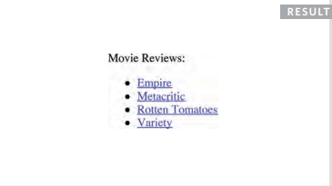

**Email Links**
mailto: 
To create a link that starts up
the user's email program and
addresses an email to a specified
email address, you use the ```<a>```
element. However, this time the
value of the href attribute starts
with mailto: and is followed by
the email address you want the
email to be sent to.
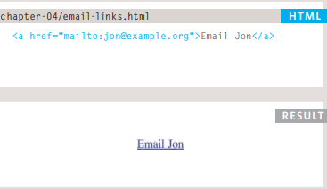


1. The ```<a>``` element uses the href attribute to indicate
the page you are linking to.
2. If you are linking to a page within your own site, it is
best to use relative links rather than qualified URLs.
3. You can create links to open email programs with an
email address in the "to" field.
4. You can use the id attribute to target elements within
a page that can be linked to.

**position:static**
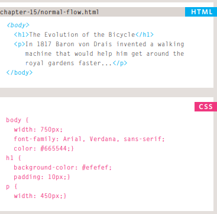
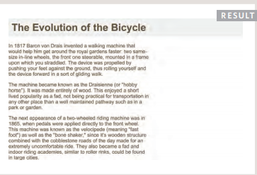
**position:relative**
Relative positioning moves an
element in relation to where it
would have been in normal flow.
For example, you can move it 10
pixels lower than it would have
been in normal flow or 20% to
the right.
You can indicate that an element
should be relatively positioned
using the position property
with a value of relative.
You then use the offset
properties (top or bottom and
left or right) to indicate how
far to move the element from
where it would have been in
normal flow.
To move the box up or down,
you can use either the top or
bottom properties.
To move the box horizontally,
you can use either the left or
right properties.
The values of the box offset
properties are usually given in
pixels, percentages or ems.
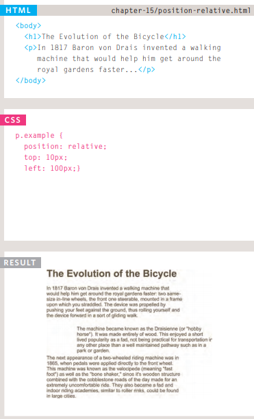.
**position:absolute**
When the position property
is given a value of absolute,
the box is taken out of normal
flow and no longer affects the
position of other elements on
the page. (They act like it is not
there.)
The box offset properties (top
or bottom and left or right)
specify where the element
should appear in relation to its
containing element.
In this example, the heading has
been positioned at the top of the
page and 500 pixels from its left
edge. The width of the heading is
set to be 250 pixels wide.
The width property has
also been applied to the ```<p>```
elements in this example
to prevent the text from
overlapping and becoming
unreadable.
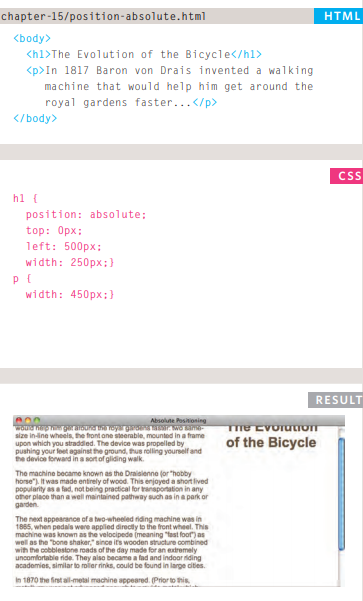
**position:fixed**
Fixed positioning is a type
of absolute positioning that
requires the position property
to have a value of fixed.
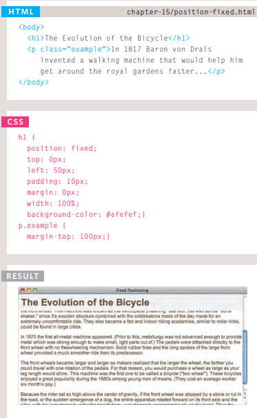
**Overlapping Elements z-index**
When you use relative, fixed, or
absolute positioning, boxes can
overlap. If boxes do overlap, the
elements that appear later in the
HTML code sit on top of those
that are earlier in the page.
If you want to control which
element sits on top, you can use
the z-index property. Its value
is a number, and the higher the
number the closer that element
is to the front. For example, an
element with a z-index of 10
will appear over the top of one
with a z-index of 5.
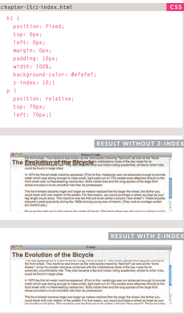
**Floating Elements**
The float property allows you
to take an element in normal
flow and place it as far to the
left or right of the containing
element as possible.
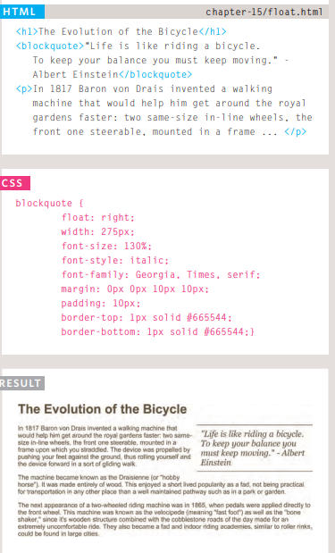
**Clearing Floats**
The clear property allows you
to say that no element (within
the same containing element)
should touch the left or righthand sides of a box. It can take
the following values:
1. left
The left-hand side of the box
should not touch any other
elements appearing in the same
containing element.
2. right
The right-hand side of the
box will not touch elements
appearing in the same containing
element.
both
Neither the left nor right-hand
sides of the box will touch
elements appearing in the same
containing element.
3. none
Elements can touch either side.
In this example, the fourth
paragraph has a class called
clear. The CSS rule for this
class uses the clear property
to indicate that nothing should
touch the left-hand side of it. The
fourth paragraph is therefore
moved further down the page
so no other element touches its
left-hand side.
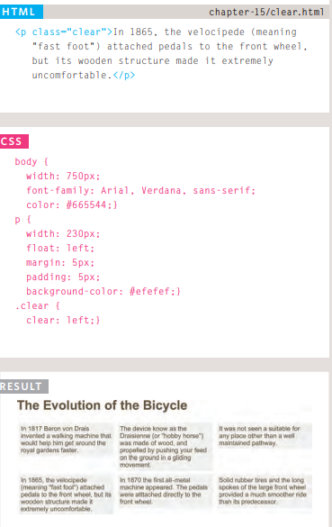
**Possible Layouts:
960 Pixel wide
12 Column Grid**
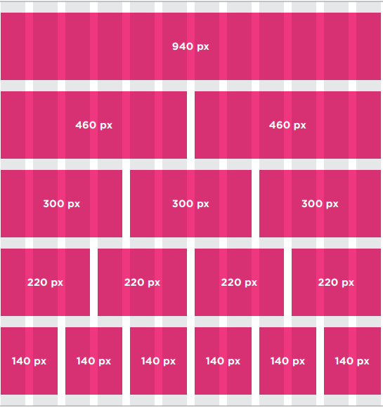
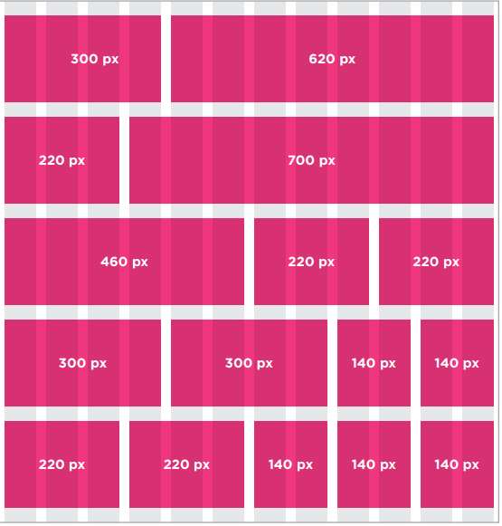
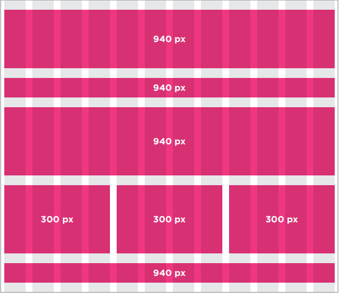
**functions in JavaSccript**
In this example, the user is
shown a message at the top of
the page. The message is held
in an HTML element whose id
attribute has a value of message.
The message is going to be
changed using JavaScript. 

```<!DOCTYPE html>
<html>
<head>
Before the closing </body>
tag, you can see the link to the
JavaScript file. The JavaScript
file starts with a variable used
to hold a new message, and is
followed by a function called
updateMessage().
<ti t l e>Basic Function</title>
<l i nk rel ="stylesheet" href="css/ c03.css" />
</head>
<body>
<hl>TravelWorthy</ hl>
<div id="message">We lcome to our site! </ div>
<script src="js/ basic-function .js"></script>
</ body>
</ html>
---------------------------

var msg = 'Sign up to receive our newsletter for 10% off!';
function updateMessage() {
var el = document.getElementByld('message'};
el .textContent = msg;
}
updateMessage(};
```
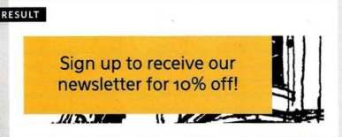
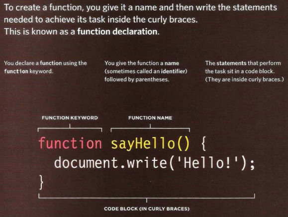
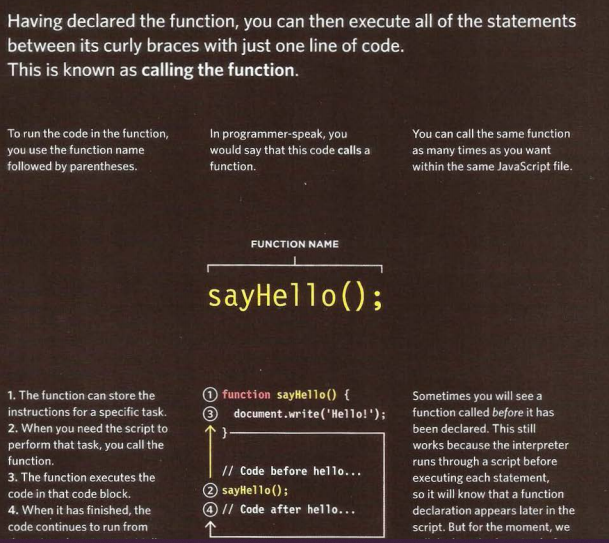


