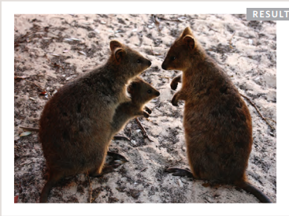
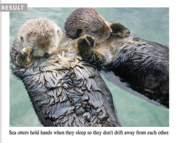
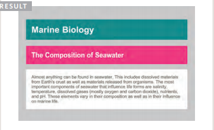
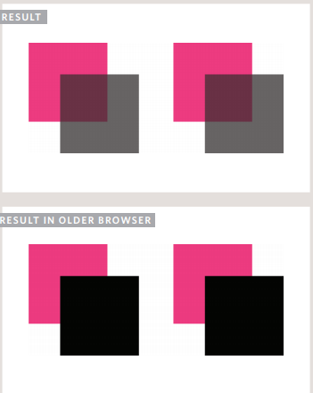

# Adding Images.
* `````` chapter-05/adding-images.html HTML
To add an image into the page
you need to use an ``````
element. This is an empty
element (which means there is
no closing tag). It must carry the
following two attributes:
```src```
This tells the browser where
it can find the image file. This
will usually be a relative URL
pointing to an image on your
own site. (Here you can see that
the images are in a child folder
called images — relative URLs
were covered on pages 83-84).
```alt```
This provides a text description
of the image which describes the
image if you cannot see it.
```title```
You can also use the title
attribute with the `````` element
to provide additional information
about the image. Most browsers
will display the content of this
attribute in a tootip when the
user hovers over the image.

```json

```
 
_____________________
_____________________

## Height & Width of Images.
height
This specifies the height of the
image in pixels.
width
This specifies the width of the
image in pixels.
Images often take longer to
load than the HTML code that
makes up the rest of the page.
It is, therefore, a good idea to
specify the size of the image
so that the browser can render
the rest of the text on the page
while leaving the right amount of
space for the image that is still
loading.
```
 ```
 ________
 ## The postions of img.
 ```
<p>There are around 10,000 living species of birds
 that inhabit different ecosystems from the
 Arctic to the Antarctic. Many species undertake
 long distance annual migrations, and many more
 perform shorter irregular journeys.</p>
<hr />
<p>There are around 10,000 living
 species of birds that inhabit different
 ecosystems from the Arctic to the Antarctic. Many
 species undertake long distance annual
 migrations, and many more perform shorter
 irregular journeys.</p>
<hr />
<p>There are around 10,000 living species of birds
 that inhabit different ecosystems from the
 Arctic to the Antarctic.Many species undertake long
 distance annual migrations, and many more perform
 shorter irregular journeys.</p>
 ```
 _________
 ## HTML5: Figure and Figure Caption.

```<figure>```
Images often come with
captions. HTML5 has introduced
a new ```<figure>```element to
contain images and their caption
so that the two are associated.
You can have more than one
image inside the ```<figure>```
element as long as they all share
the same caption.
```<figcaption>```
The ```<figcaption>```
element has
been added to HTML5 in order
to allow web page authors to add
a caption to an image.
Before these elements were
created there was no way to
associate an `````` element with
its caption.
```json
<figure>

<br />
 <figcaption>Sea otters hold hands when they
 sleep so they don't drift away from each
 other.</figcaption>
</figure>
```

_____

## Background Color background-color.

```json
body {
background-color: rgb(200,200,200);}
h1 {
background-color: DarkCyan;}
h2 {
background-color: #ee3e80;}
p {
background-color: white;}
```
.
____
## CSS3: Opacity opacity, rgba:
```json
p.one {
background-color: rgb(0,0,0);
opacity: 0.5;}
p.two {
background-color: rgb(0,0,0);
background-color: rgba(0,0,0,0.5);}
CS
```

____
* Color not only brings your site to life, but also helps
convey the mood and evokes reactions.
* There are three ways to specify colors in CSS:
RGB values, hex codes, and color names.
* Color pickers can help you find the color you want.
* It is important to ensure that there is enough contrast
between any text and the background color (otherwise
people will not be able to read your content).
* CSS3 has introduced an extra value for RGB colors to
indicate opacity. It is known as RGBA.
* CSS3 also allows you to specify colors as HSL values,
with an optional opacity value. It is known as HSLA.
___
## Typeface for your Website:
We should to input **font-family** in css then give it the type of text. For example:
1. Serif
2. Sans-Serif
3. Monospace
4. Cursive
5. Fantasy
we can also, control the size of that text by input **text-size** then give it a value. 