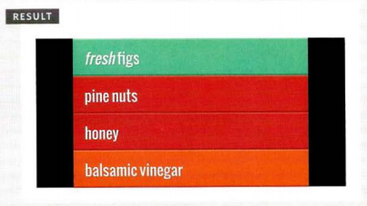
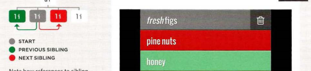

# CREATING· OBJECTS USING LITERAL NOTATION.

```json
c3/ j s/obj ect-1itera1 . j s
var hote l = {
name: 'Quay',
rooms: 40,
booked : 25,
checkAvailability: function() {
return this.rooms - this.booked;
}
} ;
JAVASCRIPT
var el Name = document .getElementByld('hotelName');
elName.textContent =hotel .name;
var elRooms = document.getElementByid{'rooms');
elRooms.textContent = hotel .checkAvailability(); 
```


This example starts by creating
an object using literal notation.
This object is called hotel which
represents a hotel called Quay
with 40 rooms (25 of which have
been booked).
Next, the content of the page
is updated with data from this
object. It shows the name of the
hotel by accessing the object's
name property and the number
of vacant rooms using the
checkAvail ability() method.
To access a property of this
object, the object name is
followed by a dot (the period
symbol) and the name of the
property that you want.
Similarly, to use the method,
you can use the object name
followed by the method name.
hotel . checkAvailability()
If the method needs parameters,
you can supply them in the
parentheses (just like you can
pass arguments to a function).
.
____
## SELECTING ELEMENTS USING ID ATTRIBUTES
get El ementByi d () allows you
to select a single element node
by specifying the value of its
id attribute.
This method has one parameter:
the value of the id attribute on
the element you want to select.
This value is placed inside quote
marks because it is a string. The
quotes can be single or double
quotes, but they must match.
In the example on the left, the
first line of JavaScript code finds
the element whose id attribute
has a value of one, and stores
a reference to that node in a
variable called e 1.
The code then uses a property
called cl assName (which you
meet on p232) to update the
value of the cl ass attribute
of the element stored in this
variable. Its value is coo 1, and
this triggers a new rule in the
CSS that sets the background
color of the element to aqua. 
```json
Html
<hl id="header">List King<lhl>
<h2>Buy groceries<lh2>
<ul>
<li id="one" class="hot"><em>fresh<lem>
figs<lli>
<li id="two" class="hot">pine nuts<lli>
<li id="three" class="hot">honey<lli>
<li id="four">balsamic vi negar<ll i>
</ul> 
```
````
JV
II Select the element and store it in a variable.
var el = document.getElementByid('one');
II Change the value of the class attribute.
el.className ='cool ' ; 
````

The result

_____
## PREVIOUS & NEXT SIBLING:
```json
<ul><li id="one" class="hot"><em>fresh<l em> figs<l li><li id="two"
class="hot">pine nuts<l li><li id="three" class="hot">honey<l li><li
id="four ">balsamic vinegar<lli><lul> 
```
```json
JV
c05/ js/sibling.js
II Select the starting point and find its siblings
var startltem = document.getElementByid('two');
var prevltem startltem.previousSibling;
var nextltem = startitem.nextSibling;
II Change the values of the siblings' class attributes
prevltem.className 'complete ' ;
nextltem.className 'cool'; 
```
The result of that is:

____
## ACCESS & UPDATE TEXT & MARKUP WITH INNERHTML:
Using the i nnerHTML property, you can access
and amend the contents of an element,
including any child elements.
innerHTML
When getting HTML from an
element, the i nnerHTML property
will get the content of an
element and return it as one long
string, including any markup that
the element contains.
When used to set new content
for an element, it will take a
string that can contain markup
and process that string, adding
any elements within it to the
DOM tree.
When adding new content using
i nnerHTML, be aware that one
missing closing tag could throw
out the design of the entire page. 
___
## REMOVING ELEMENTS VIA DOM MANIPULATION:
1. STORE THE ELEMENT
TO BE REMOVED IN A
VARIABLE
You start by selecting the
element that is going to be
removed and store that element
node in a variable.
You can use any of the methods
you saw in the section on DOM
queries to select the element. 
2. 
STORE THE PARENT OF
THAT ELEMENT IN A
VARIABLE
Next, you find the parent element
that contains the element you
want to remove and store that
element node in a variable.
The simplest way to get this
element is to use the parentNode
property of this element. 
3. 
REMOVE THE ELEMENT
FROM ITS CONTA INING
ELEMENT
The removeChi ld() method is
used on the containing element
that you selected in step 2.
The removeChi ld() method
takes one parameter: the
reference to the element that
you no longer want.
____
* The browser represents the page using a DOM tree.
* DOM trees have four types of nodes: document nodes,
element nodes, attribute nodes, and text nodes.
* You can select element nodes by their id or cl ass
attributes, by tag name, or using CSS selector syntax.
* Whenever a DOM query can return more than one
node, it will always return a Nadel i st.
* From an element node, you can access and update its
content using properties such as textContent and
i nnerHTML or using DOM manipulation techniques.
* An element node can contain multiple text nodes and
child elements that are siblings of each other.
* In older browsers, implementation of the DOM is
inconsistent (and is a popular reason for using jQuery).
* Browsers offer tools for viewing the DOM tree .  
_____