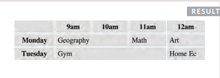
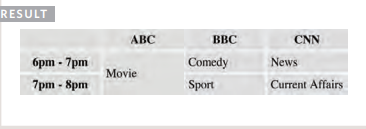
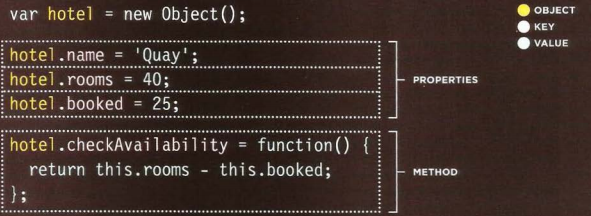

# Tables
## The structure of table is 
* ```<table></table>``` : which is the element that should start with and close it in rder to make a table.
* ```<tr></tr>```: the column of the table.
* ```<td></td>```: which is the row of the table.
____
```<th>```
## if we want to add a head to a table we this element.
___
```colspan```.
## colspan element is used to make a a space to rows by using numbers for. Like,
```<table>
 <tr>
 <th></th>
 <th>9am</th>
 <th>10am</th>
 <th>11am</th>
 <th>12am</th>
 </tr>
 <tr>
 <th>Monday</th>
 <td colspan="2">Geography</td>
 <td>Math</td>
 <td>Art</td>
 </tr>
 <tr>
 <th>Tuesday</th>
 <td colspan="3">Gym</td>
 <td>Home Ec</td>
 </tr>
</table>
```
 
 ___
```rowspan```.
## to make spaces in rows.
```<table>
 <tr>
 <th></th>
 <th>ABC</th>
 <th>BBC</th>
 <th>CNN</th>
 </tr>
 <tr>
 <th>6pm - 7pm</th>
 <td rowspan="2">Movie</td>
 <td>Comedy</td>
 <td>News</td>
 </tr>
 <tr>
 <th>7pm - 8pm</th>
 <td>Sport</td>
 <td>Current Affairs</td>
 </tr>
</table>
```

___
1. The ```<table>``` element is used to add tables to a web
page.
2. A table is drawn out row by row. Each row is created
with the ```<tr>``` element.
3. Inside each row there are a number of cells
represented by the ```<td>``` element (or ```<th>``` if it is a
header).
4. You can make cells of a table span more than one row
or column using the rowspan and colspan attributes.
5. For long tables you can split the table into a ```<thead>```,
```<tbody>```, and ```<tfoot>```.
___
# how to make an object:
## we start by idenify by using variable, then we put inside the variable that we want to add and finally git him function with return to see the result.
.
____
# THE BROWSEROBJECT MODEL:THE WINDOW OBJECT
* window . innerHeight ->Height of window (excluding browser chrome/user interface) (in pixels.
* window.location->Current URL of window object (or local file path). 
* ```i sNaN () ```->Checks if the value is not a number.
* ```toFi xed() ```->Rounds to specified number of decimal places (returns a string). 
* ```toPreci s i on()```-> Rounds to total number of places (returns a string).
___
## The perfect example:
```I* The scri pt is placed i nside an immediately invoked function expression
which helps prot ect the scope of variables *I
-(function() {
II PART ONE : CREATE HOTEL OBJECT AND WRITE OUT THE OFFER DETAILS
II Create a hotel obj ect using object lit eral syntax
var hotel = {
name: 'Park',
roomRate: 240, II Amount in dollars
discount : 15, II Percentage di scount
offerPrice : function() {
var offerRate = this.roomRate * ((100 - this.discount) I 100);
return offerRate;
II Write out the hotel name , standard rate, and the special rat e
var hotel Name, roomRate, specialRate ; II Declare variables
hotelName = document .getElementByid('hotelName');
roomRate = document.getElementByid('roomRate');
specialRate = document .getElementByld('specialRate');
II Get el ements
hotelName.textContent = hotel .name; II Write hotel name
roomRate.textContent = '$ ' + hotel .roomRate .toFixed(2) ; II Write room rate
specialRate .textContent = '$' +hotel .offerPrice(); II Write offer pri ce 
```
___
## finally,
* Functions allow you to group a set of related
statements together that represent a single task.
* Functions can take parameters (informatiorJ required
to do their job) and may return a value.
* An object is a series of variables and functions that
represent something from the world around you.
* In an object, variables are known as properties of the
object; functions are known as methods of the object.
* Web browsers implement objects that represent both
the browser window and the document loaded into the
browser window.
* JavaScript also has several built-in objects such as
String, Number, Math, and Date. Their properties and
methods offer functionality that help you write scripts.
* Arrays and objects can be used to create complex data
sets (and both can contain the other). 