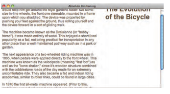
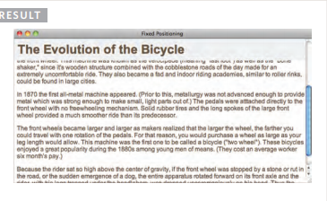
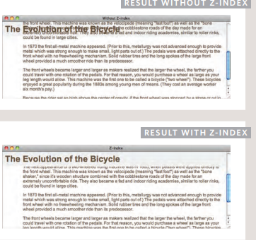
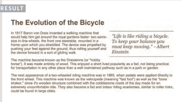

# Key Concepts in Positioning Elements.
1. position:static:
I have not specified a width
property for the heading
element, so you can see how it
stretches the width of the entire
browser window by default.

_____________
2. position:relative:
Relative positioning moves an
element in relation to where it
would have been in normal flow.

____
3. position:absolute:
When the position property
is given a value of absolute,
the box is taken out of normal
flow and no longer affects the
position of other elements on
the page. (They act like it is not
there.)
The box offset properties (top
or bottom and left or right)
specify where the element
should appear in relation to its
containing element.


____
4. position:fixed:
Fixed positioning is a type
of absolute positioning that
requires the position property
to have a value of fixed.
```html
<body>
<h1>The Evolution of the Bicycle</h1>
<p class="example">In 1817 Baron von Drais
 invented a walking machine that would help him
 get around the royal gardens faster...</p>
</body
```
``` css
h1 {
position: fixed;
top: 0px;
left: 50px;
padding: 10px;
margin: 0px;
width: 100%;
background-color: #efefef;}
p.example {
margin-top: 100px;}
```

____
## Overlapping Elements:
1. z-index:
If you want to control which
element sits on top, you can use
the z-index property. Its value
is a number, and the higher the
number the closer that element
is to the front. For example, an
element with a z-index of 10
will appear over the top of one
with a z-index of 5.
```css
h1 {
position: fixed;
top: 0px;
left: 0px;
margin: 0px;
padding: 10px;
width: 100%;
background-color: #efefef;
z-index: 10;}
p {
position: relative;
top: 70px;
left: 70px;}
```

_____
2. float
The float property allows you
to take an element in normal
flow and place it as far to the
left or right of the containing
element as possible.
Anything else that sits inside
the containing element will
flow around the element that is
floated.
```css
blockquote {
 float: right;
 width: 275px;
 font-size: 130%;
 font-style: italic;
 font-family: Georgia, Times, serif;
 margin: 0px 0px 10px 10px;
 padding: 10px;
 border-top: 1px solid #665544;
 border-bottom: 1px solid #665544;}
 ```
 
 _______

 The clear property allows you
to say that no element (within
the same containing element)
should touch the left or righthand sides of a box. It can take
the following values:
* Left

The left-hand side of the box
should not touch any other
elements appearing in the same
containing element.
* Right

The right-hand side of the
box will not touch elements
appearing in the same containing
element.
* Both

Neither the left nor right-hand
sides of the box will touch
elements appearing in the same
containing element.
* None 

Elements can touch either side.
____


