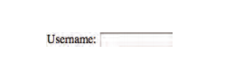
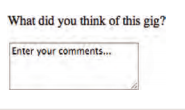
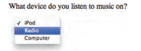
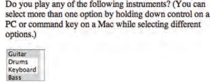
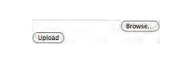
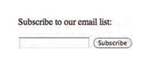
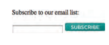
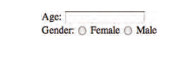

```<input>```:
The ```<input>``` element is used
to create several different form
controls. The value of the type
attribute determines what kind
of input they will be creating.
***maxlength
You can use the maxlength
attribute to limit the number
of characters a user may enter
into the text field. Its value is the
number of characters they may
enter. For example, if you were
asking for a year, the maxlength
attribute could have a value of 4.***

***sizeThe size attribute should not
be used on new forms. It was
used in older forms to indicate
the width of the text input
(measured by the number of
characters that would be seen).
For example, a value of 3 would
create a box wide enough to
display three characters***
```html
<form action="http://www.example.com/login.php">
<p>Username:
 <input type="text" name="username" size="15"
 maxlength="30" />
</p>
</form>
```

_______

## Types of input:
1. Text inpout.
2. Passowrd input.
3. Radio.
4. Checkbox.
____
```<textarea>```
```html

<form action="http://www.example.com/comments.php">
<p>What did you think of this gig?</p>
 <textarea name="comments" cols="20" rows="4">Enter
 your comments...</textarea>
</form
```

____
# Drop Down List Box
## First: select,option
```html
<form action="http://www.example.com/profile.php">
<p>What device do you listen to music on?</p>
<select name="devices">
 <option value="ipod">iPod</option>
 <option value="radio">Radio</option>
 <option value="computer">Computer</option>
 </select>
</form>
```

____
# second, mutliple.
```html
<form action="http://www.example.com/profile.php">
<p>Do you play any of the following instruments?
 (You can select more than one option by holding
 down control on a PC or command key on a Mac
 while selecting different options.)</p>
<select name="instruments" size="3"
 multiple="multiple">
 <option value="guitar" selected="selected">
 Guitar</option>
 <option value="drums">Drums</option>
 <option value="keyboard"
 selected="selected">Keyboard</option>
 <option value="bass">Bass</option>
</select>
</form>
``` 

______
## File Input Box:
```html
<form action="http://www.example.com/upload.php"
method="post">
<p>Upload your song in MP3 format:</p>
<input type="file" name="user-song" /><br />
<input type="submit" value="Upload" />
</form>
```

_____
## Submit Button:
```html
<form action="http://www.example.com/subscribe.php">
<p>Subscribe to our email list:</p>
<input type="text" name="email" />
<input type="submit" name="subscribe"
 value="Subscribe" />
</form>
```

_____
## Image Button:
```html
<form action="http://www.example.org/subscribe.php">
<p>Subscribe to our email list:</p>
 <input type="text" name="email" />
 <input type="image" src="images/subscribe.jpg"
 width="100" height="20" />
</form>
```

_____
## Label:
```html
<label>Age: <input type="text" name="age" /></label>
<br/ >
Gender:
<input id="female" type="radio" name="gender"
value="f">
<label for="female">Female</label>
<input id="male" type="radio" name="gender"
value="m">
<label for="male">Male</label>
```

_______
## Bullet Point Styles:
```list-style-type```
is used to add style for unorder list.

Unordered Lists
For an unordered list you can use
the following values:

 none
 
 disc

 circle

 square

Ordered Lists
For an ordered (numbered) list
you can use the following values:
decimal
1 2 3

decimal-leading-zero
01 02 03

lower-alpha
a b c

upper-alpha
A B C

lower-roman
i. ii. iii.

upper-roman
I II III
_________


